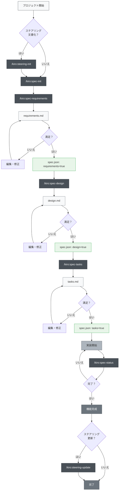
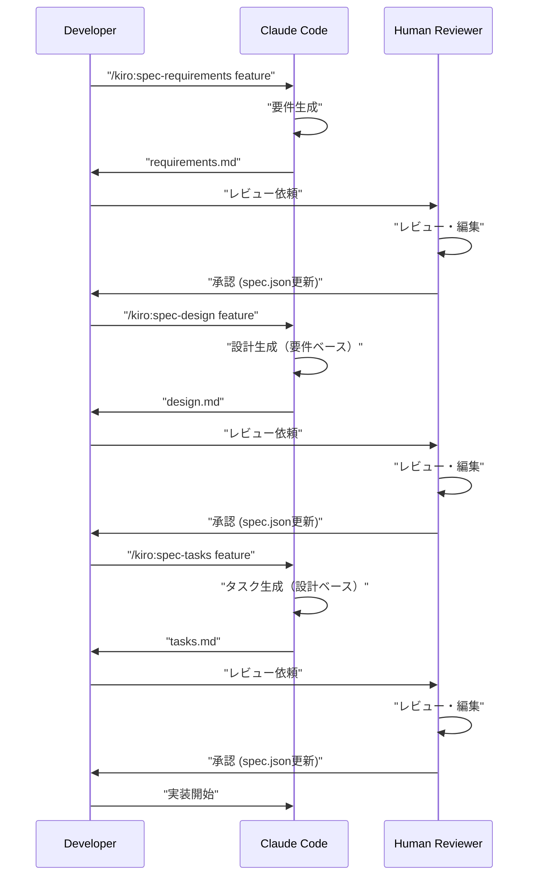

# CLAUDE.md

This file provides guidance to Claude Code (claude.ai/code) when working with code in this repository.

## Project Overview

This is a LINE Mini App project built with Next.js 15.4.1 (App Router), TypeScript 5, React 19.1.0, and LIFF (LINE Front-end Framework) v2.27.0. The main application is in `/line-mini-app-project/`.

## Essential Commands

```bash
# Development
npm run dev          # Start development server with Turbopack (http://localhost:3000)

# Build and Production
npm run build        # Build for production
npm run start        # Start production server

# Code Quality
npm run lint         # Run ESLint
```


## Test-Driven Development (TDD)

We adopt the t-wada style of Test-Driven Development (TDD). This approach emphasizes writing tests before writing any production code, guiding the design and ensuring code quality.

### Principles of t-wada TDD

1.  **Red (Write a failing test):** Write a small, focused test that describes a single piece of desired functionality. This test should fail because the functionality doesn't exist yet.
2.  **Green (Make the test pass):** Write the minimum amount of production code necessary to make the failing test pass. Do not write any more code than what is required to satisfy the test.
3.  **Refactor (Improve the code):** Once the test passes, refactor the code to improve its design, readability, and maintainability, without changing its external behavior. Ensure all tests still pass after refactoring.

This cycle (Red-Green-Refactor) is repeated for each small piece of functionality.

### Development Guidelines with TDD

-   **Always start with a test:** No production code should be written without a failing test first.
-   **Small steps:** Write tests and code in very small increments.
-   **Focus on one thing:** Each test should focus on a single responsibility or behavior.
-   **Refactor constantly:** Improve the code's internal structure as you go, keeping tests green.
-   **Tests as documentation:** Well-written tests serve as living documentation of the code's behavior.

## Architecture

### Directory Structure
- `/line-mini-app-project/` - Main LINE Mini App
  - `app/` - Next.js App Router pages (file-based routing)
    - `page.tsx` - Main page with LIFF integration
    - `layout.tsx` - Root layout with Geist fonts
  - `components/` - Reusable React components
  - `lib/` - Utility functions and helpers
  - `public/` - Static assets
  - `.env.local` - Environment variables (LIFF_ID)

### Key Architecture Patterns

1. **LIFF Integration Pattern**: Client-side only with "use client" directive
   ```typescript
   // Always use client-side for LIFF
   "use client";
   
   // Initialize LIFF in useEffect
   useEffect(() => {
     liff.init({ liffId: process.env.NEXT_PUBLIC_LIFF_ID! })
   }, [])
   ```

2. **Environment Variables**: Use NEXT_PUBLIC_ prefix for client-side variables
   - Store in `.env.local`
   - Access via `process.env.NEXT_PUBLIC_LIFF_ID`

3. **Component Structure**: Functional components with TypeScript and hooks

## Critical Rules (from GEMINI.md)

1. **Test-Driven Development (TDD)**: Follow t-wada style TDD (Red → Green → Refactor)
2. **Commit Messages**: Use Conventional Commits format (feat:, fix:, docs:, etc.)
3. **Task Documentation**: Record all tasks in `/task_memory/YYYYMMDD_task_name/`
4. **Security**: Never commit sensitive data - use environment variables
5. **No git push**: Never execute git push commands
6. **Component Philosophy**: Self-contained, reusable components with single responsibility

## LIFF Development Notes

- LIFF SDK is loaded via CDN in `app/layout.tsx`
- User authentication flow: liff.init() → liff.login() → liff.getProfile()
- Always check `liff.isLoggedIn()` before accessing user data
- LIFF functions must run client-side only

## Common Development Tasks

When implementing new features:
1. Create components in `/components/` directory
2. Use TypeScript interfaces for props
3. Follow existing Tailwind CSS patterns
4. Test LIFF features with actual LINE app (not just browser)

## Important Design Principles

- ドメイン駆動設計 (DDD) の採用
- Repository パターンでのデータアクセス抽象化
- TypeScript厳格型チェック必須
- テストファーストな開発フロー

### Development Considerations

- Firestore Rules と BigQuery スキーマの整合性確保
- セキュリティ：認証・権限制御の徹底実装
- パフォーマンス：バッチサイズ制御とキャッシュ戦略

## Memory Bank 運用

### 構造
```
memory-bank/
├── projectbrief.md      # プロジェクト固定要件
├── productContext.md    # プロダクトの目的と価値
├── activeContext.md     # 現在の作業状況
├── systemPatterns.md    # システムアーキテクチャ
├── techContext.md       # 技術スタック詳細
└── progress.md          # 進捗と残タスク
```

### 更新タイミング
1. 大きな設計変更時
2. 重要な実装完了時
3. ユーザーが "update memory bank" を指示した時
4. 新セッション開始時は必ずactiveContext.mdを確認

## 適応的並列作業管理

### 概要
複数のClaude Codeインスタンスをtmuxで並列実行し、大規模なタスクを効率的に処理する方法。振り返りセッションから得られた「適応的品質管理」の知見を反映した進化版。

**理論的基盤**: AI固有協調モデル（AICM-BSA）
- 📚 **完全設計書**: `/workspace/task_memory/ai_collaborative_model_design/ai_collaborative_model_design.md`

**核心概念**:
- **AI同一性活用**: 人間組織模倣からの脱却、同一AIによる冗長チェック活用
- **検証ベース協調**: 信頼関係でなく客観的検証に基づく品質保証
- **段階的品質管理**: 技術レイヤーに応じた適応的品質基準
- **建設的対立促進**: 多角的批判による設計改善と学習促進

メインのスレッドをPMとしサブスレッドをtmuxで立てる。その時作業はサブスレッド=部下に割り当て、メインはPMに徹する。
これらを実施する際には考えた過程や調査結果、作業結果などを都度task_memory/YYYYMMDD/{task_name}/{file_name}.mdファイルにアウトプットし過程を日本語で残してください。
また最終的に同ドキュメントに作成した成果物に関して解説や使い方など詳しく解説してください。
注意点や設計の考え方など、他プロジェクトに入っているエンジニアが理解できる程度の解像度で書いてください。
このタスクドキュメントは毎回消す必要はなく積み上がっていきます。
不明点があれば勝手に進めずに、userに質問してください。

### 適応的品質管理の統合
従来の効率重視から、**品質と効率の両立**を目指す新しいアプローチ：
- 技術特性に応じた段階的品質基準
- 実践派と理論派の価値統合
- トライアンドエラーを許容する学習重視

### 認知バイアス対策と AI同一性の認識

#### 専門性の錯覚（Illusion of Expertise）対策
並列作業での重要な認知バイアス発見：
- **問題**: 異なるpaneのClaude Codeを異なる専門性を持つ人間チームと錯覚する
- **実態**: 全て同一のAIモデルで、専門性の違いは存在しない
- **対策**: AI同一性を明確に認識し、役割分担は作業効率のためのみとする

#### AI同一性の明確認識
**基本原則**: 全paneは同じClaude Codeインスタンス
```markdown
✅ 正しい認識:
- 同一AIによる並列処理で作業効率を向上
- 役割分担は単なる作業分割（専門性ではない）
- 情報共有は必須（同じAIでも独立したセッション）

❌ 避けるべき錯覚:
- 各paneが異なる専門性を持つと思い込む
- 人間チームと同様のコミュニケーションを期待
- 専門分野による自動的な品質差を想定
```

#### 人間組織思考の投影防止
- **階層構造**: PMとして管理するが、実際は同一AI
- **専門分化**: 役割分担は効率のため、能力差ではない
- **コミュニケーション**: 情報伝達は必須、推測は不可

### PM メインスレッドの責務（適応的品質管理版）

#### 戦略フェーズ（事前準備強化）
まずタスクの全体像を理解し、実行計画を作り適切な単位で分解してください。
その際、必ずアウトプットの目的と目標を定めてください。目標は途中で変わっても構いませんが目的が変わってはいけません。

**新規追加：事前準備強化**
- ソーステーブルDDLの完全確認
- 全使用カラムの存在確認  
- ファイル依存関係マップ作成
- データセット整合性確認
- タスク固有要点整理の提供

#### 実行フェーズ（段階的介入）
部下に適切にタスクを振り分けて並列で高速に実行してください。
それぞれ部下に必要なタスク・情報を渡してください。その際に適切な量のコンテキストを渡してください。
短すぎると作業ができません。

**新規追加：技術特性に応じた品質管理**
- データ層: 100%品質要求（最初から完璧）
- ロジック層: 80%品質許容（段階的改善）
- UI層: 60%品質許容（トライアンドエラー）

**新規追加：段階的介入モデル**
- Phase 1: 集中作業重視（最小限チェック）
- Phase 2: 技術変更時チェック（限定介入）
- Phase 3: 統合確認（包括チェック）

#### 品質管理フェーズ（統合的確認）
**🚨 PM品質管理の最重要責務**
ただし最終的に成果物の正しさはあなたに責務があります。
アウトプットの形が正しいか、ぶれていないかは必ず確認してください。

**🔥 緊急追加：最終確認プロセスの必須化**
以下のステップを必ず実行し、ユーザー報告前の品質を確保する：

1. **実装状況の厳格確認**
   - 部下が報告した「完了」内容が実際に実装されているかを検証
   - 未実装機能の完了宣言を絶対に許可しない
   - 必要に応じて実際のファイル・コードを直接確認

2. **成果物の実在性確認**
   - 作成されたファイルが実際に存在するかを確認
   - ファイル内容が要求仕様通りかを検証
   - 動作確認が可能な場合は必ず実行

3. **ユーザー要求との整合性確認**
   - 本来の目的・目標とアウトプットがあっているか
   - 余計な変更をしていないか
   - 内容に間違いがないか
   - ユーザーの当初の指示内容の意図からずれていないか

**⚠️ 重要：完了宣言のタイミング**
- **禁止**: 部下からの報告のみに基づく完了宣言
- **必須**: PM自身による実装確認後の完了宣言
- **原則**: ユーザー承認前の勝手な完了宣言は絶対禁止

進捗管理もPMの責務です。
進捗が遅れている場合やエラー、ミスがあった場合は確認し適切な対処法を考えて指示してください。
部下には進捗は定期的に報告させるか、何か問題がありそうな状況になったら連絡をさせるようにしてください。
PMはその都度全体像を見た上で必要な判断を下し、アドバイスをしてください。

#### 学習フェーズ（振り返り必須）
**新規追加：建設的対立促進**
- プロジェクト完了後の振り返りセッション実施
- 双方向議論による深い学習の促進
- 本質的争点の発見と統合解の創出
- 次回プロジェクトへの改善反映


### tmux pane構成作成：基本的な画面分割
```bash
# 5つのpaneに分割
tmux split-window -h && tmux split-window -v && tmux select-pane -t 0 && tmux split-window -v && tmux select-pane -t 2 && tmux split-window -v && tmux select-pane -t 4 && tmux split-window -v
```

<!-- # 現在のセッション内で画面分割 今後工夫する。
 tmux split-window -h -p 30  # 右側30%で横分割
 tmux split-window -v -t 1   # 右側を縦分割 -->

### pane番号の確認

```
# pane構造とIDの確認（実際の番号は環境により異なる）
tmux list-panes -F "#{pane_index}: #{pane_id} #{pane_current_command} #{pane_active}"
# 例の出力:
# 0: %22 zsh 1  (メインpane)
# 1: %27 zsh 0  (部下1)
# 2: %28 zsh 0  (部下2)
# 3: %25 zsh 0  (部下3) 
# 4: %29 zsh 0  (部下4)
# 5: %26 zsh 0  (部下5)
```


### 並列作業の実行フロー

#### 1.  Claude Codeセッション起動:部下ペインでClaude Code起動

%27等の番号について: これらはtmuxが自動割り当てするpane IDです。上記の確認コマンドで実際のIDを確認してから使用してください。

```bash
# 全paneで並列起動（実際のpane IDに置き換えて使用）
tmux send-keys -t %27 "cc" && sleep 0.1 && tmux send-keys -t %27 Enter & \
tmux send-keys -t %28 "cc" && sleep 0.1 && tmux send-keys -t %28 Enter & \
tmux send-keys -t %25 "cc" && sleep 0.1 && tmux send-keys -t %25 Enter & \
tmux send-keys -t %29 "cc" && sleep 0.1 && tmux send-keys -t %29 Enter & \
tmux send-keys -t %26 "cc" && sleep 0.1 && tmux send-keys -t %26 Enter & \
wait
```

#### 2. タスク割り当て方法（品質管理強化版）

基本テンプレートをもとにPMとしての責務を果たせるように工夫をしてください。

```bash
# 品質管理強化テンプレート
tmux send-keys -t %27 "cd 'ワーキングディレクトリ' && あなたはpane1です。タスク内容。【重要】完了報告時は以下フォーマット必須：[pane1] 完了: タスク名 | 作成ファイル: path/to/file | 実装機能: 機能名 | 確認方法: 検証手順。エラー時は[pane1]でtmux send-keys -t %22でメイン報告。" && sleep 0.1 && tmux send-keys -t %27 Enter

# 並列タスク割り当て例（品質チェック組込み）
tmux send-keys -t %27 "タスク1の内容。完了時は実装内容の詳細報告必須。" && sleep 0.1 && tmux send-keys -t %27 Enter & \
tmux send-keys -t %28 "タスク2の内容。完了時は実装内容の詳細報告必須。" && sleep 0.1 && tmux send-keys -t %28 Enter & \
tmux send-keys -t %25 "タスク3の内容。完了時は実装内容の詳細報告必須。" && sleep 0.1 && tmux send-keys -t %25 Enter & \
wait
```

**🚨 部下への品質管理指示（必須項目）**
タスク割り当て時に以下を必ず伝える：
1. **実装証跡の必須報告**: 作成ファイルの正確なパス
2. **機能実装の具体的説明**: 何がどのように実装されたか
3. **検証可能な報告**: PMが確認できる方法を明示
4. **未実装部分の明確化**: 実装されていない部分は正直に報告

指示やコンテキストが長文になる場合はmarkdownファイルに指示内容を記載するか、分割して指示を送ってください。


#### 3. 進捗確認:報連相システム


部下からメインへの報告形式
部下は以下のワンライナーで報告：

```bash
tmux send-keys -t %22 '[pane番号] 報告内容' && sleep 0.1 && tmux send-keys -t %22 Enter
```

部下から報連相できるように、タスク依頼時に上記の方法を教えて上げてください。また、/clear を頻繁にするので、2回目以降でもタスクの末尾に報連相の方法を加えておくと良いです。

例
```bash
tmux send-keys -t %22 '[pane1] タスク完了しました' && sleep 0.1 && tmux send-keys -t %22 Enter
tmux send-keys -t %22 '[pane3] エラーが発生しました：詳細内容' && sleep 0.1 && tmux send-keys -t %22 Enter
```

### 状況確認コマンド
なぜ必要か: 部下からの報告に加えて、以下の場面でコマンド確認が有効です：

部下が応答しない時（フリーズ、エラー状態の確認）
報告内容の詳細確認（エラーメッセージの全文確認）
作業状況の客観的把握（進捗の可視化）
トラブルシューティング時（ログの確認）


```bash
# pane状況確認
# 各paneの最新状況確認
tmux capture-pane -t %27 -p | tail -10
tmux capture-pane -t %28 -p | tail -10

# 全pane一括確認
for pane in %27 %28 %25 %29 %26; do
    echo "=== $pane ==="
    tmux capture-pane -t $pane -p | tail -5
done
```


### トークン管理

#### 深い思考が必要な時

#### トークン別キーワード表（英語・日本語）

| 言語   | 最大予算 (31,999トークン)                                                | 中予算 (10,000トークン)                                      | 小予算 (4,000トークン)       |
|--------|--------------------------------------------------------------------------|--------------------------------------------------------------|------------------------------|
| 英語   | think harder<br>think intensely<br>think longer<br>think really hard<br>think super hard<br>think very hard<br>ultrathink | think about it<br>think a lot<br>think deeply<br>think hard<br>think more<br>megathink | think                        |
| 日本語 | 熟考<br>深く考えて<br>しっかり考えて                                       | もっと考えて<br>たくさん考えて<br>よく考えて<br>長考              | 考えて                       |

### 実践的なTips

- **段階的なアプローチ**  
  まず `think` で試し、出力が浅ければ `think more`、さらに必要なら `think harder` と段階的に強める。

- **コストを意識する**  
  思考トークンも課金対象であることを意識し、本当に深い思考が必要な場合にのみ `ultrathink` を使う。

- **タスクに応じた使い分け**  
  - 簡単なバグ修正：`think`  
  - アーキテクチャ設計：`think deeply`  
  - 複雑なアルゴリズム最適化：`ultrathink`

- **筆者の運用例**  
  最大の効果を求めるために最大予算のキーワードのみ使用。直近ではすべてのプロンプト末尾に `ultrathink` を自動付与するマクロを利用している。

### /clearコマンドの実行

部下は自分で/clearできないため、メインが判断して実行：

#### 実行タイミングの判断基準:

- タスク完了時（新しいタスクに集中させるため）
- トークン使用量が高くなった時（ccusageで確認）
- エラーが頻発している時（コンテキストをリセット）
- 複雑な作業から単純な作業に切り替える時

```bash
# 個別にクリア実行
tmux send-keys -t %27 "/clear" && sleep 0.1 && tmux send-keys -t %27 Enter

# 並列/clear
tmux send-keys -t %27 "/clear" && sleep 0.1 && tmux send-keys -t %27 Enter & \
tmux send-keys -t %28 "/clear" && sleep 0.1 && tmux send-keys -t %28 Enter & \
tmux send-keys -t %25 "/clear" && sleep 0.1 && tmux send-keys -t %25 Enter & \
wait
```

### 実装時の注意点

#### 権限確認への対応
- Claude Codeが権限確認を求める場合は「1」を選択
- 頻繁に使用する場合は「2」（今後確認しない）を選択可能

#### Enter キーの送信
- 指示送信後、必ず`C-m`でEnterキーを送信
- 反応がない場合は追加で`tmux send-keys -t [pane] C-m`を実行

### 適応的品質管理ベストプラクティス

#### 1. 技術レイヤー別品質基準
```markdown
| レイヤー | 品質要求 | アプローチ | 理由 |
|----------|----------|------------|------|
| データ層 | 100% | 最初から完璧 | 整合性・正確性が必須 |
| ロジック層 | 80% | 段階的改善 | 機能実現後に最適化 |
| UI層 | 60% | トライアンドエラー | ユーザビリティは試行錯誤 |
```

#### 2. 段階的介入モデル
**Phase 1: 集中作業期（最小限チェック）**
- 目的: 個人の集中力を最大化
- チェック: 致命的エラーのみ
- 期間: タスクの70%完了まで

**Phase 2: 技術変更点チェック（限定介入）**
- 目的: 技術的整合性の確保
- チェック: スキーマ・API・依存関係
- タイミング: 重要変更完了時

**Phase 3: 統合確認（包括チェック）**
- 目的: 全体品質の確保
- チェック: 機能・性能・ドキュメント
- タイミング: プロジェクト完了時

#### 3. 情報提供の三層化
1. **戦略情報**: CLAUDE.md（包括的ガイドライン）
2. **戦術情報**: タスク固有要点整理（即座参照用）
3. **構造情報**: 依存関係マップ（視覚的理解）

#### 4. 事前準備強化チェックリスト
タスク開始前に以下を必ず実施：
```markdown
□ ソーステーブルDDLの完全確認
□ 全使用カラムの存在確認
□ ファイル依存関係マップ作成
□ データセット整合性確認
□ 類似プロジェクトからの学習
□ タスク固有要点整理の提供
```

#### 5. 実践派vs理論派の統合
**実践派価値の活用**
- 現場対応力（問題発生時の迅速解決）
- 経験則活用（過去の学習の反映）
- 柔軟性（状況適応能力）

**理論派価値の活用**
- 体系的思考（構造化されたアプローチ）
- 予防思考（重要ポイントでの事前チェック）
- 標準化（再現性の確保）

#### 6. 報告フォーマットの標準化（品質強化版）
```bash
# 統一フォーマット
'[pane番号] ステータス: 詳細内容 | 進捗: X% | 次のアクション: Y'
```

**🚨 新規追加：完了報告時の必須情報**
部下が「完了」を報告する際は以下を必ず含める：
```bash
'[pane番号] 完了: タスク名 | 作成ファイル: path/to/file.ext | 実装機能: 具体的機能名 | 確認方法: 検証手順'
```

**⚠️ PM確認義務（完了宣言前必須プロセス）**
部下から完了報告を受けた際、PMは以下を必ず実行：
1. **ファイル存在確認**: `ls path/to/reported/file` で実在確認
2. **コード実装確認**: `grep "具体的実装内容" ファイル名` で実装検証
3. **機能動作確認**: 可能な場合は実際の動作テスト実行
4. **仕様適合確認**: ユーザー要求との整合性チェック

**🔥 完了判断権限の明確化**
- **禁止**: 部下の完了報告のみに基づくユーザーへの完了宣言
- **必須**: PM自身による実装確認完了後の報告
- **原則**: 「実装されていない機能の既存記載」は重大品質問題として扱う

#### 7. リソース管理
   - 長時間作業では`/clear`でコンテキストリセット
   - トークン使用量の監視,大量トークン消費の監視
   - 定期的な/clear実行
   - ccusageでの使用量確認 `npx ccusage@latest`

#### 8. エラー対処と品質管理（緊急強化版）
**🚨 重大ミス防止策**
  - **実装完了の厳格確認**: 部下報告を鵜呑みにせず、必ず実装実態を確認
  - **未実装機能記載の絶対禁止**: 存在しない機能の完了報告を防止
  - **PM責任の明確化**: 最終品質はPMが必ず検証してから報告
  - **段階的検証プロセス**: 中間確認→実装確認→最終確認の3段階実施
  - Web検索による解決策調査を指示
  - 具体的エラー内容の共有
  - 成功事例の横展開
  - 技術特性に応じた品質基準の適用

**🔍 実装確認チェックリスト**
```markdown
□ 報告されたファイルが実際に存在するか
□ ファイル内容が要求仕様を満たしているか
□ 動作確認が可能な場合は実際に実行
□ 未実装部分が完了として報告されていないか
□ ユーザー要求からの乖離がないか
```

#### 9. 機能固有ドキュメント 4項目評価基準（標準化）
振り返りから得られた効果的なドキュメント評価基準を標準化：

**基本4項目**
1. **機能概要**: 何をするものか、対象者は誰か
2. **技術選択理由**: なぜその技術・手法を選んだか
3. **実装パターン**: 具体的な実装方法と特徴
4. **運用・保守性**: 導入後の管理方法、トラブルシューティング

**評価基準の活用場面**
- PM による成果物レビュー時
- ドキュメント品質の客観的判断
- 他プロジェクトエンジニアへの引き継ぎ準備
- 振り返りセッションでの改善点発見

**品質チェックポイント**
```markdown
□ 機能概要: 5分で理解できる明確さ
□ 技術選択: 代替案との比較が記載
□ 実装: 実際のコード例・設定例あり  
□ 運用性: 問題発生時の対処法明記
```

#### 10. 緊急追加：重大ミス防止システム（最優先）

**🔥 同じミスを二度と起こさないための絶対的品質管理**

##### A. PM最終確認プロセス（必須実行）
```bash
# 部下完了報告受信後、PMが必ず実行するコマンド
# 1. ファイル存在確認
ls -la /reported/file/path

# 2. 実装内容確認
grep -n "実装されたはずの機能" ファイル名
cat ファイル名 | head -20  # 内容の実在確認

# 3. 機能動作確認（可能な場合）
# 実際の動作テスト実行

# 4. 全体整合性確認
# ユーザー要求との照合
```

##### B. 実装裏取りチェックリスト（必須）
```markdown
🚨 部下完了報告チェック（PM必須実行）
□ 報告されたファイルが実際に存在するか？
□ ファイル内容に報告された機能が実装されているか？
□ 未実装機能が「既存」として記載されていないか？
□ ユーザー要求から逸脱していないか？
□ 動作確認が可能な場合は実際に動作するか？

❌ 一つでも確認できない場合は「未完了」として扱う
✅ 全て確認できた場合のみユーザーに完了報告
```

##### C. 完了宣言権限の厳格管理
**絶対的原則**:
- 部下の報告 ≠ 完了
- PM確認完了 = 完了
- ユーザー承認前の勝手な完了宣言は重大な責任問題

**実行フロー**:
1. 部下報告受信
2. PM実装裏取り確認（上記A,B実行）
3. 確認完了後にのみユーザー報告
4. ユーザー承認を得て正式完了

##### D. エラー対処（継続監視）
```bash
# 問題発見時の対処コマンド
tmux send-keys -t %部下pane "報告内容に問題があります。実装状況を再確認し、正確な情報で再報告してください。" && sleep 0.1 && tmux send-keys -t %部下pane Enter
```


## AI固有協調モデル（AICM-BSA: Balanced Simplicity Approach）

建設的対立セッションにより設計された、AI特性を活かしつつ実用性を重視したバランス型協調システム。

### 設計思想：適応的シンプリシティ

**核心洞察**: 真の革新は適切なシンプル化にある（第三者評価 2025年06月24日）

#### 基本原則
1. **tmux+bash ネイティブ**: 既存環境を最大活用
2. **段階的改善**: 一度に全てを変えない
3. **強制人間ゲート**: 確実な品質保証
4. **AI同一性の活用**: 人間組織模倣からの脱却

### Phase 1: 基本品質ゲート（即座実装可能）

#### 完了報告の進化版フォーマット
```bash
# シンプルかつ確実な完了確認システム
function report_completion_v2() {
    local pane_id=$1
    local task_name=$2
    local output_file=$3
    
    echo "=== 完了報告 pane${pane_id} ==="
    echo "タスク: ${task_name}"
    echo "ファイル: ${output_file}"
    echo ""
    
    # 基本チェック実行（自動化）
    echo "✓ ファイル存在: $(ls -la ${output_file} 2>/dev/null || echo 'なし')"
    echo "✓ 未実装マーカー数: $(grep -c '（未実装）' ${output_file} 2>/dev/null || echo '0')"
    echo "✓ 実装済みマーカー数: $(grep -c '（現在実装済み）' ${output_file} 2>/dev/null || echo '0')"
    echo "✓ ファイルサイズ: $(stat -c%s ${output_file} 2>/dev/null || echo '0') bytes"
    echo ""
    
    # 人間確認要求（強制ゲート）
    echo "🚨 PMによる確認が必要です"
    echo "上記ファイルを確認し、品質チェックしてください"
}
```

#### 強制人間ゲート（スキップ不可能）
```bash
function mandatory_human_gate() {
    local task_summary=$1
    local files_to_check=("${@:2}")
    
    echo "===================="
    echo "🛑 品質ゲート: 人間確認必須"
    echo "===================="
    echo "タスク: ${task_summary}"
    echo ""
    echo "確認必要ファイル:"
    for file in "${files_to_check[@]}"; do
        echo "  - ${file}"
        if [[ -f "$file" ]]; then
            echo "    サイズ: $(stat -c%s "$file" 2>/dev/null) bytes"
            echo "    最終更新: $(stat -c%y "$file" 2>/dev/null)"
        else
            echo "    ⚠️ ファイルが存在しません"
        fi
    done
    echo ""
    echo "確認項目:"
    echo "  1. ファイルが正しく作成されているか"
    echo "  2. 未実装機能が実装済みとして記載されていないか"
    echo "  3. 内容が仕様通りか"
    echo "  4. 新規エンジニアが理解できる内容か"
    echo ""
    
    while true; do
        read -p "すべて確認しましたか？ (y/n/detail): " response
        case $response in
            y) echo "✅ 承認完了"; return 0 ;;
            n) echo "❌ 再作業が必要"; return 1 ;;
            detail) show_detailed_check_guide ;;
            *) echo "y, n, detail のいずれかを入力してください" ;;
        esac
    done
}

function show_detailed_check_guide() {
    echo ""
    echo "=== 詳細確認ガイド ==="
    echo ""
    echo "1. 実装状況確認方法:"
    echo "   grep '（未実装）' ファイル名    # 0件であることを確認"
    echo "   grep '（現在実装済み）' ファイル名  # 適切に表記されていることを確認"
    echo ""
    echo "2. 内容確認のコツ:"
    echo "   head -20 ファイル名    # 冒頭部分の確認"
    echo "   tail -10 ファイル名    # 末尾部分の確認"
    echo "   wc -l ファイル名       # 行数確認（極端に少ない場合は要注意）"
    echo ""
    echo "3. よくある問題パターン:"
    echo "   - 未実装機能を実装済みとして記載"
    echo "   - ファイルは作成されているが中身が空"
    echo "   - 古い情報や間違った技術仕様"
    echo "   - 説明が技術的すぎて理解困難"
    echo ""
}
```

### Phase 2: 相互検証システム（1週間後実装）

#### シンプルなペア確認
```bash
function setup_peer_verification() {
    local producer_pane=$1
    local checker_pane=$2
    local output_file=$3
    
    echo "=== ペア確認システム開始 ==="
    echo "作成者: pane${producer_pane}"
    echo "確認者: pane${checker_pane}"
    echo "対象: ${output_file}"
    
    # チェッカーに具体的な確認タスクを送信
    tmux send-keys -t %${checker_pane} "
ペア確認タスク（AI同一性を活用した冗長チェック）:
ファイル ${output_file} の品質確認を実施してください。

確認項目:
1. ファイル存在・アクセス確認
2. 実装状況表記の正確性チェック
   - '（未実装）' マーカーが適切に使われているか
   - 実装されていない機能が実装済みとして記載されていないか
3. 技術的内容の整合性
4. 新規エンジニアにとっての理解しやすさ

確認完了時は以下で報告:
tmux send-keys -t %0 '[ペア確認] pane${checker_pane}→pane${producer_pane}: 結果(合格/不合格) 詳細' && sleep 0.1 && tmux send-keys -t %0 Enter
" Enter

    echo "ペア確認タスクを pane${checker_pane} に送信しました"
}
```

### Phase 3: 自動化補助（2週間後実装）

#### 基本自動チェック機能
```bash
function auto_quality_check() {
    local file=$1
    local errors=()
    local warnings=()
    
    echo "=== 自動品質チェック実行 ==="
    echo "対象ファイル: $file"
    echo ""
    
    # ファイル存在チェック
    if [[ ! -f "$file" ]]; then
        errors+=("❌ ファイルが存在しません: $file")
        echo "結果: エラー - ファイル未存在"
        return 1
    fi
    
    # 基本メトリクス
    local file_size=$(stat -c%s "$file" 2>/dev/null || echo 0)
    local line_count=$(wc -l < "$file" 2>/dev/null || echo 0)
    local unimpl_count=$(grep -c '（未実装）' "$file" 2>/dev/null || echo 0)
    local impl_count=$(grep -c '（現在実装済み）' "$file" 2>/dev/null || echo 0)
    
    echo "📊 ファイル基本情報:"
    echo "   サイズ: ${file_size} bytes"
    echo "   行数: ${line_count} 行"
    echo "   未実装マーカー: ${unimpl_count} 件"
    echo "   実装済みマーカー: ${impl_count} 件"
    echo ""
    
    # 品質チェック
    if [[ $file_size -lt 100 ]]; then
        warnings+=("⚠️ ファイルサイズが小さすぎます (${file_size} bytes)")
    fi
    
    if [[ $line_count -lt 10 ]]; then
        warnings+=("⚠️ 行数が少なすぎます (${line_count} 行)")
    fi
    
    if [[ $impl_count -eq 0 && $unimpl_count -eq 0 ]]; then
        errors+=("❌ 実装状況の表記がありません")
    fi
    
    # 結果表示
    echo "🔍 チェック結果:"
    if [[ ${#errors[@]} -gt 0 ]]; then
        echo "❌ エラー発見:"
        for error in "${errors[@]}"; do
            echo "   $error"
        done
        echo ""
        echo "=> 再作業が必要です"
        return 1
    fi
    
    if [[ ${#warnings[@]} -gt 0 ]]; then
        echo "⚠️ 警告:"
        for warning in "${warnings[@]}"; do
            echo "   $warning"
        done
        echo ""
        echo "=> 警告がありますが、継続可能です"
    fi
    
    echo "✅ 自動チェック合格"
    echo "=> 人間による最終確認に進んでください"
    return 0
}
```

### Phase 4: 学習機能（継続開発）

#### 問題パターン学習システム
```bash
function record_quality_issue() {
    local issue_type=$1
    local description=$2
    local fix_action=$3
    local issue_log="/workspace/task_memory/quality_improvement.log"
    
    # ログディレクトリ作成
    mkdir -p "$(dirname "$issue_log")"
    
    # 構造化ログの記録
    cat >> "$issue_log" << EOF
[$(date '+%Y-%m-%d %H:%M:%S')] 品質問題記録
問題タイプ: $issue_type
説明: $description
対処法: $fix_action
発生セッション: $(tmux display-message -p '#S')
=====================================

EOF
    
    echo "品質問題パターンを記録しました: $issue_log"
}

function show_quality_history() {
    local issue_log="/workspace/task_memory/quality_improvement.log"
    
    if [[ -f "$issue_log" ]]; then
        echo "=== 過去の品質問題パターン ==="
        tail -50 "$issue_log" | grep -E "(問題タイプ|説明|対処法)" | tail -15
        echo ""
        echo "完全なログ: $issue_log"
    else
        echo "品質問題の記録はまだありません"
    fi
}

# 自動改善提案
function suggest_quality_improvements() {
    local current_issues=("$@")
    
    echo "=== 品質改善提案 ==="
    for issue in "${current_issues[@]}"; do
        case "$issue" in
            *"未実装マーカー"*)
                echo "💡 提案: 実装状況チェックの自動化を強化"
                echo "   コマンド例: grep -r '（未実装）' . --include='*.md'"
                ;;
            *"ファイルサイズ"*)
                echo "💡 提案: 最小コンテンツ要件の設定"
                echo "   例: README.mdは最低500文字以上"
                ;;
            *"技術的整合性"*)
                echo "💡 提案: クロスリファレンスチェックの導入"
                echo "   例: API仕様とコード実装の自動照合"
                ;;
        esac
    done
}
```

### 実装ガイド：段階的導入計画

#### 第1週: 基本実装
```bash
# CLAUDE.md改善アクション
echo "=== AICM-BSA 第1週導入チェックリスト ==="
echo "□ 完了報告フォーマットv2の導入"
echo "□ 強制人間ゲートシステムの実装"
echo "□ 詳細確認ガイドの準備"
echo "□ チーム内での新フォーマット共有"
echo ""
echo "導入コマンド例:"
echo "source /workspace/CLAUDE.md  # 新機能の読み込み"
echo "mandatory_human_gate 'テストタスク' 'test.md'  # ゲート機能テスト"
```

#### 第2週: ペア確認追加
```bash
echo "=== AICM-BSA 第2週導入チェックリスト ==="
echo "□ ペア確認システムの実装"
echo "□ AI同一性を活用した冗長チェック運用開始"
echo "□ 確認プロセスの効率化"
echo "□ フィードバック収集と改善"
```

#### 第3週以降: 継続改善
```bash
echo "=== AICM-BSA 継続改善サイクル ==="
echo "□ 自動化補助機能の段階的追加"
echo "□ 問題パターン学習の蓄積"
echo "□ より効率的なワークフローの模索"
echo "□ 他プロジェクトへの展開検討"
```

### 成功指標とモニタリング

#### 品質指標
```bash
# 定期的な品質測定
function measure_quality_metrics() {
    local period=$1  # weekly, monthly
    
    echo "=== AICM-BSA 品質指標測定 ($period) ==="
    echo "📊 未実装機能誤記載: $(grep -r '（未実装）.*（現在実装済み）' /workspace/docs/ 2>/dev/null | wc -l) 件"
    echo "📊 人間ゲート通過率: 実装予定"
    echo "📊 ペア確認発見率: 実装予定"
    echo "📊 自動チェック精度: 実装予定"
}
```

### エラー対処とトラブルシューティング

#### よくある問題と解決策
```bash
function troubleshoot_aicm() {
    echo "=== AICM-BSA トラブルシューティング ==="
    echo ""
    echo "1. 人間ゲートが応答しない場合:"
    echo "   - Ctrl+C で一度中断"
    echo "   - mandatory_human_gate を再実行"
    echo ""
    echo "2. ペア確認が機能しない場合:"
    echo "   - tmux セッションの確認: tmux list-panes"
    echo "   - pane IDの確認と修正"
    echo ""
    echo "3. 自動チェックでエラーが出る場合:"
    echo "   - ファイル権限の確認: ls -la ファイル名"
    echo "   - grep コマンドのエラー確認"
    echo ""
    echo "4. ログが記録されない場合:"
    echo "   - ディレクトリ権限の確認"
    echo "   - mkdir -p /workspace/task_memory"
}
```

## 建設的対立促進ガイドライン

振り返りセッションから得られた知見に基づく、チーム学習を促進する対立管理手法。

### 対立の価値認識

#### 表面的合意 vs 建設的対立
- ❌ **表面的合意**: 早期収束、深い検討なし
- ✅ **建設的対立**: 異なる視点の衝突から新しい解の創出

#### 本質的争点の発見
従来の理解を超えた真の対立軸を発見：
- **表面**: 品質 vs 効率
- **本質**: 実践派 vs 理論派（不確実性への対処方針の違い）

### 振り返りセッション実践手法

#### 双方向議論の促進
```bash
# 批判的質問の例
tmux send-keys -t %X "pane Yが提案した内容について、反対の立場から批判的にコメントしてください。具体的な問題点や懸念を挙げてください。"

# 反駁の促進
tmux send-keys -t %Y "pane Xからの批判に対して、あなたの立場から反駁してください。"

# 統合質問
tmux send-keys -t %Z "これまでの議論を踏まえて、対立する意見を統合する第三の選択肢を提案してください。"
```

#### ファシリテーション技法

**1. 対立軸の明確化**
- 各参加者の価値観とコアビリーフの特定
- 表面的争点と本質的争点の分離
- 対立の構造化（軸の整理）

**2. 建設的批判の促進**
- 感情的でなく論理的な批判の奨励
- 具体的な経験に基づく議論の要求
- 相互批判による多角的検討

**3. 統合解の共同創出**
- 対立を乗り越える創造的思考の促進
- 異なる価値観を活かす設計思想
- 実装可能性を考慮した現実的解決

### 価値観駆動開発

#### ユーザー価値観の明確化と優先順位
1. **品質と効率の両立**: どちらも犠牲にしない
2. **トライアンドエラー許容**: 完璧性より学習重視
3. **必要十分品質**: 過剰品質の回避

#### 技術決定の判断基準
```python
def quality_decision(layer, complexity, time_constraint, user_values):
    if layer == "data":
        return "100% quality required"  # 整合性必須
    elif layer == "logic":
        return "80% quality + iterative improvement"  # 段階的改善
    elif layer == "ui":
        return "60% quality + trial and error"  # ユーザビリティ重視
```

### 対立解決パターン

#### パターン1: 技術特性適応
- **問題**: 一律の品質基準適用
- **解決**: 技術レイヤーに応じた適応的基準

#### パターン2: 段階的統合
- **問題**: 実践派 vs 理論派の対立
- **解決**: 状況に応じた使い分けと価値の統合

#### パターン3: 情報アーキテクチャ改善
- **問題**: 個人責任 vs システムサポート
- **解決**: 三層情報提供による構造化支援

### 継続的改善サイクル

#### 1. 振り返りセッション（必須・改善版）
- プロジェクト完了後の対立促進議論
- 各参加者の価値観と思考プロセスの共有
- 本質的争点の発見と統合解の創出
- **新規追加**: 認知バイアス（専門性の錯覚等）の検出と対策
- **新規追加**: 4項目評価基準による成果物の客観的評価

#### 2. 学習の蓄積（構造化強化）
- 対立パターンとその解決策のデータベース化
- 成功事例と失敗事例の体系的整理
- 継続的な手法の精緻化
- **新規追加**: 認知バイアス事例集の蓄積
- **新規追加**: AI同一性理解度の測定と改善

#### 3. 次回プロジェクトへの反映（即座適用）
- 学んだ統合手法の即座実装
- 改善されたプロセスの試験運用
- 効果測定と更なる改善
- **新規追加**: バイアス対策の事前共有
- **新規追加**: 4項目基準の事前セットアップ

#### 4. メタ学習サイクル（新規追加）
**振り返りから振り返りへの学習**
- 振り返り手法自体の改善
- より深い気づきを得るための質問設計
- 異なる視点からの多角的検討促進
- AI特性を活かした新しい対立促進手法の開発

### 実装時の注意点

#### 心理的安全性の確保
- 批判は人格でなくアイデアに対して
- 失敗を責めず学習機会として活用
- 異なる意見の価値を明示的に認める

#### PMの責務
- 対立の促進と方向性の管理
- 表面的合意への誘導を避ける
- 統合解創出の支援と品質確保


# Claude Code Spec-Driven Development

This project implements Kiro-style Spec-Driven Development for Claude Code using hooks and slash commands.

## Project Context

### Project Steering
- Product overview: `.kiro/steering/product.md`
- Technology stack: `.kiro/steering/tech.md`
- Project structure: `.kiro/steering/structure.md`
- Custom steering docs for specialized contexts

### Active Specifications
- Current spec: Check `.kiro/specs/` for active specifications
- Use `/kiro:spec-status [feature-name]` to check progress

## Development Guidelines
- Think in English, but generate responses in Japanese (思考は英語、回答の生成は日本語で行うように)

## Spec-Driven Development Workflow

### Phase 0: Steering Generation (Recommended)

#### Kiro Steering (`.kiro/steering/`)
```
/kiro:steering-init          # Generate initial steering documents
/kiro:steering-update        # Update steering after changes
/kiro:steering-custom        # Create custom steering for specialized contexts
```

**Note**: For new features or empty projects, steering is recommended but not required. You can proceed directly to spec-requirements if needed.

### Phase 1: Specification Creation
```
/kiro:spec-init [feature-name]           # Initialize spec structure only
/kiro:spec-requirements [feature-name]   # Generate requirements → Review → Edit if needed
/kiro:spec-design [feature-name]         # Generate technical design → Review → Edit if needed
/kiro:spec-tasks [feature-name]          # Generate implementation tasks → Review → Edit if needed
```

### Phase 2: Progress Tracking
```
/kiro:spec-status [feature-name]         # Check current progress and phases
```

## Spec-Driven Development Workflow

Kiro's spec-driven development follows a strict **3-phase approval workflow**:

### Phase 1: Requirements Generation & Approval
1. **Generate**: `/kiro:spec-requirements [feature-name]` - Generate requirements document
2. **Review**: Human reviews `requirements.md` and edits if needed
3. **Approve**: Manually update `spec.json` to set `"requirements": true`

### Phase 2: Design Generation & Approval
1. **Generate**: `/kiro:spec-design [feature-name]` - Generate technical design (requires requirements approval)
2. **Review**: Human reviews `design.md` and edits if needed
3. **Approve**: Manually update `spec.json` to set `"design": true`

### Phase 3: Tasks Generation & Approval
1. **Generate**: `/kiro:spec-tasks [feature-name]` - Generate implementation tasks (requires design approval)
2. **Review**: Human reviews `tasks.md` and edits if needed
3. **Approve**: Manually update `spec.json` to set `"tasks": true`

### Implementation
Only after all three phases are approved can implementation begin.

**Key Principle**: Each phase requires explicit human approval before proceeding to the next phase, ensuring quality and accuracy throughout the development process.

## Development Rules

1. **Consider steering**: Run `/kiro:steering-init` before major development (optional for new features)
2. **Follow the 3-phase approval workflow**: Requirements → Design → Tasks → Implementation
3. **Manual approval required**: Each phase must be explicitly approved by human review
4. **No skipping phases**: Design requires approved requirements; Tasks require approved design
5. **Update task status**: Mark tasks as completed when working on them
6. **Keep steering current**: Run `/kiro:steering-update` after significant changes
7. **Check spec compliance**: Use `/kiro:spec-status` to verify alignment

## Automation

This project uses Claude Code hooks to:
- Automatically track task progress in tasks.md
- Check spec compliance
- Preserve context during compaction
- Detect steering drift

### Task Progress Tracking

When working on implementation:
1. **Manual tracking**: Update tasks.md checkboxes manually as you complete tasks
2. **Progress monitoring**: Use `/kiro:spec-status` to view current completion status
3. **TodoWrite integration**: Use TodoWrite tool to track active work items
4. **Status visibility**: Checkbox parsing shows completion percentage

## Getting Started

1. Initialize steering documents: `/kiro:steering-init`
2. Create your first spec: `/kiro:spec-init [your-feature-name]`
3. Follow the workflow through requirements, design, and tasks

## Kiro Steering Details

Kiro-style steering provides persistent project knowledge through markdown files:

### Core Steering Documents
- **product.md**: Product overview, features, use cases, value proposition
- **tech.md**: Architecture, tech stack, dev environment, commands, ports
- **structure.md**: Directory organization, code patterns, naming conventions

### Custom Steering
Create specialized steering documents for:
- API standards
- Testing approaches
- Code style guidelines
- Security policies
- Database conventions
- Performance standards
- Deployment workflows

### Inclusion Modes
- **Always Included**: Loaded in every interaction (default)
- **Conditional**: Loaded for specific file patterns (e.g., `"*.test.js"`)
- **Manual**: Loaded on-demand with `#filename` reference


## 使い方

### 1. 新規プロジェクトの場合

```bash
# オプション: プロジェクトステアリング生成（推奨だが必須ではない）
/kiro:steering-init

# ステップ1: 新機能の仕様作成開始（詳細な説明を含める）
/kiro:spec-init "ユーザーがPDFをアップロードして、その中の図表を抽出し、AIが内容を説明する機能を作りたい。技術スタックはNext.js、TypeScript、Tailwind CSSを使用。"

# ステップ2: 要件定義（自動生成されたfeature-nameを使用）
/kiro:spec-requirements pdf-diagram-extractor
# → .kiro/specs/pdf-diagram-extractor/requirements.md をレビュー・編集

# ステップ3: 要件承認（手動）
# spec.json で "requirements": true に設定

# ステップ4: 技術設計
/kiro:spec-design pdf-diagram-extractor
# → .kiro/specs/pdf-diagram-extractor/design.md をレビュー・編集

# ステップ5: 設計承認（手動）
# spec.json で "design": true に設定

# ステップ6: タスク生成
/kiro:spec-tasks pdf-diagram-extractor
# → .kiro/specs/pdf-diagram-extractor/tasks.md をレビュー・編集

# ステップ7: タスク承認（手動）
# spec.json で "tasks": true に設定

# ステップ8: 実装開始
```

### 2. 既存プロジェクトへの機能追加

```bash
# オプション: ステアリング更新（プロジェクトに大きな変更があった場合）
/kiro:steering-update

# または、既存プロジェクトでも初めてステアリングを作成する場合
/kiro:steering-init

# ステップ1: 新機能の仕様作成開始
/kiro:spec-init "新しい機能の詳細な説明をここに記述"
# 以降は新規プロジェクトと同じ
```

### 3. 進捗確認

```bash
# 特定機能の進捗確認
/kiro:spec-status my-feature

# 現在のフェーズ、承認状況、タスク進捗が表示される
```

## Spec-Driven Development プロセス

### プロセスフロー図

このフローでは、各フェーズで「レビュー・承認」にspec.jsonの更新が含まれている。

**ステアリング文書**は、プロジェクトに関する永続的な知識（アーキテクチャ、技術スタック、コード規約など）を記録するドキュメントです。作成・更新はオプションだが、プロジェクトの長期的な保守性を高めるために推奨される。



## スラッシュコマンド一覧

### 🚀 Phase 0: プロジェクトステアリング（オプション）

| コマンド | 用途 | 使用タイミング |
|---------|------|---------------|
| `/kiro:steering-init` | 初期ステアリング文書の生成 | 新規/既存プロジェクトで文書化が必要な時 |
| `/kiro:steering-update` | ステアリング文書の更新 | 大きな変更後、定期的なメンテナンス時 |
| `/kiro:steering-custom` | カスタムステアリング文書の作成 | 特殊な規約やガイドラインが必要な時 |

**注意**: ステアリング文書は推奨されるが必須ではない。小規模な機能追加や試験的な開発では省略可能。

#### ステアリング文書の種類
- **product.md**: プロダクト概要、機能、ユースケース
- **tech.md**: アーキテクチャ、技術スタック、開発環境
- **structure.md**: ディレクトリ構造、コード規約、命名規則
- **カスタム文書**: API規約、テスト方針、セキュリティポリシー等

### 📋 Phase 1: 仕様作成

| コマンド | 用途 | 使用タイミング |
|---------|------|---------------|
| `/kiro:spec-init [詳細なプロジェクト説明]` | プロジェクト説明から仕様構造を初期化 | 新機能開発開始時 |
| `/kiro:spec-requirements [feature-name]` | 要件定義書の生成 | 仕様初期化後すぐ |
| `/kiro:spec-design [feature-name]` | 技術設計書の生成 | 要件承認後 |
| `/kiro:spec-tasks [feature-name]` | 実装タスクの生成 | 設計承認後 |

### 📊 Phase 2: 進捗管理

| コマンド | 用途 | 使用タイミング |
|---------|------|---------------|
| `/kiro:spec-status [feature-name]` | 現在の進捗とフェーズ確認 | 開発中随時 |

## 3フェーズ承認ワークフロー

このシステムの核心は、各フェーズで人間によるレビューと承認を必須とする



## ベストプラクティス

### ✅ 推奨事項

1. **常にステアリングから開始**
   - 新規プロジェクトでは必ず `/kiro:steering-init` を実行
   - 既存プロジェクトでも `/kiro:steering-update` で最新化

2. **フェーズを飛ばさない**
   - 要件 → 設計 → タスクの順序を厳守
   - 各フェーズで必ず人間によるレビューを実施

3. **定期的な進捗確認**
   - `/kiro:spec-status` で現在の状況を把握
   - タスクの完了状況を適切に更新

4. **ステアリングの保守**
   - 大きな変更後は `/kiro:steering-update` を実行
   - プロジェクトの成長に合わせて更新

### ❌ 避けるべきこと

1. **承認なしでの次フェーズ移行**
   - spec.jsonの手動更新を忘れない

2. **ステアリング文書の放置**
   - 古い情報は開発の妨げになる

3. **タスクステータスの未更新**
   - 進捗が不明確になり管理が困難に

## プロジェクト構造

```
.
├── .claude/
│   └── commands/          # スラッシュコマンド定義
│       └── kiro/
│           ├── spec-init.md
│           ├── spec-requirements.md
│           ├── spec-design.md
│           ├── spec-tasks.md
│           ├── spec-status.md
│           ├── steering-init.md
│           ├── steering-update.md
│           └── steering-custom.md
├── .kiro/
│   ├── steering/          # ステアリング文書
│   │   ├── product.md
│   │   ├── tech.md
│   │   └── structure.md
│   └── specs/             # 機能仕様
│       └── [feature-name]/
│           ├── spec.json      # フェーズ承認状態
│           ├── requirements.md # 要件定義書
│           ├── design.md      # 技術設計書
│           └── tasks.md       # 実装タスク
├── CLAUDE.md              # メイン設定（下記いずれかの言語ファイルからコピー）
├── CLAUDE_en.md           # 英語版設定
├── CLAUDE_zh-TW.md        # 繁体字版設定
├── README.md              # 日本語版 README
├── README_en.md           # 英語版 README
├── README_zh-TW.md        # 繁体字版 README
└── （あなたのプロジェクトファイル）
```

## 自動化機能

Claude Codeのフック機能により以下が自動化されている

- タスク進捗の自動追跡
- 仕様遵守のチェック
- コンパクト時のコンテキスト保持
- ステアリングドリフトの検出

## トラブルシューティング

### コマンドが動作しない場合
1. `.claude/commands/` ディレクトリの存在を確認
2. コマンドファイルの命名規則を確認（`command-name.md`）
3. Claude Codeの最新バージョンを使用しているか確認

### 承認フローで詰まった場合
1. `spec.json` の承認フラグを手動で確認
2. 前フェーズの承認が完了しているか確認
3. `/kiro:spec-status` で現在の状態を診断