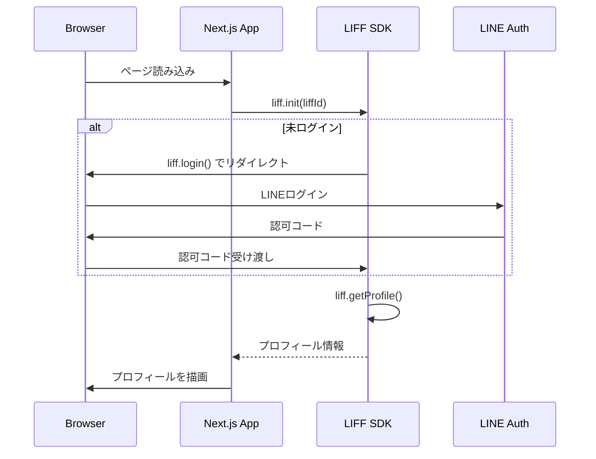
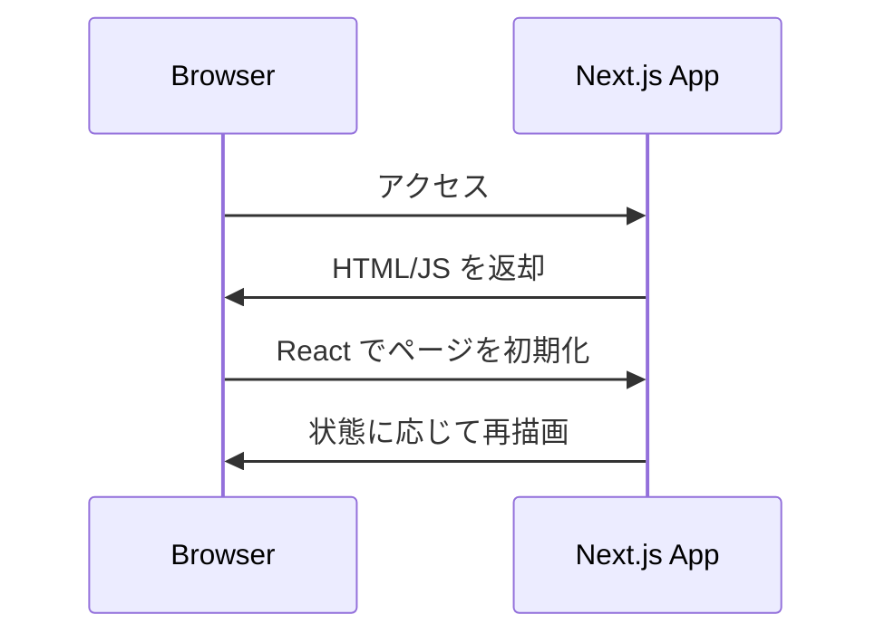

# プロジェクト設計

本プロジェクトは Next.js 15 (App Router) と LIFF SDK を用いて構築された LINE Mini App です。小規模なアプリケーションのため、クリーンアーキテクチャや DDD の考え方を参考にしつつ、シンプルな構成で実装しています。

## ディレクトリ構成

```
line-mini-app-project/
├── app/            # ページおよびレイアウト
│   ├── layout.tsx  # ルートレイアウト
│   └── page.tsx    # メインページ
├── public/         # 静的ファイル
├── postcss.config.mjs
├── next.config.ts
└── package.json
```

- `line-sample/` は Next.js のサンプルコードです。開発の参考用で、本番では使用しません。
- `task_memory/` にはタスクログが時系列で保存されています。

## 技術スタック
- Next.js 15.4.1 (App Router)
- React 19
- TypeScript 5
- Tailwind CSS 4
- LIFF SDK v2.27.0

## アーキテクチャ概要

Next.js の App Router 構成をベースに、LIFF SDK をクライアントサイドで初期化し、LINE ログインおよびプロフィール取得を行っています。外部データベースは利用せず、ユーザー情報は React の state に一時的に保持します。

### ログイン処理の流れ
以下は `app/page.tsx` におけるログイン処理のシーケンス図です。



### レンダリングフロー



### データ保存場所
- `NEXT_PUBLIC_LIFF_ID` : `.env.local` に保存し、クライアントサイドで利用
- ユーザープロフィール : `useState` で保持するのみ（永続化なし）
- タスク履歴 : `task_memory/` 以下の Markdown ファイル

今後機能が増える場合は、ドメイン層・アプリケーション層・インフラ層に分割していくことを検討します。
