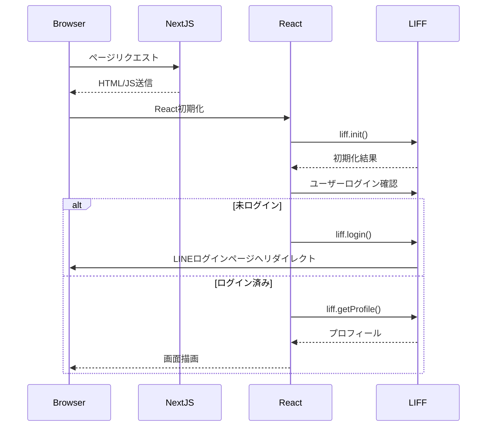

# プロジェクト設計

本プロジェクトでは Next.js を基盤とし、Clean Architecture や Domain-Driven Design(DDD) の考え方を参考にシンプルな構成を採用しています。以下に主要なディレクトリ構造とデータの流れを示します。

## ディレクトリ構造
```
line-mini-app/
├─ line-mini-app-project/        # メインアプリ
│  ├─ app/                       # Next.js App Router ページ
│  ├─ components/                # React コンポーネント(現在は未作成)
│  ├─ lib/                       # ユーティリティ関数
│  └─ public/                    # 静的アセット
├─ line-sample/                  # Next.js サンプルアプリ
└─ task_memory/                  # 開発ログ
```

## 技術スタック
- **フレームワーク**: Next.js 15 (App Router)
- **言語**: TypeScript 5
- **UI**: React 19
- **スタイリング**: Tailwind CSS 4
- **LINE連携**: LIFF v2.27

## レンダリングフロー
ブラウザからのリクエストを受け、Next.js サーバーは初期HTMLを返します。その後、Reactがクライアント側で起動し、LIFF SDKを介したログインチェックやプロフィール取得処理が実行されます。



## データ保存
ユーザーのプロフィール情報はフロントエンドの状態として保持されるのみで、サーバー側に保存していません。LIFF SDK が利用するアクセストークンはブラウザのストレージに保持されます。

## Clean Architectureとの関係
アプリ規模が小さいため明確なレイヤ分割は行っていませんが、今後の拡張を見据え`components`や`lib`ディレクトリを用意しています。ドメインロジックが増えた場合は`domain`層を作成し、アプリケーション層(`use-cases`)とUI層を分離する方針です。
