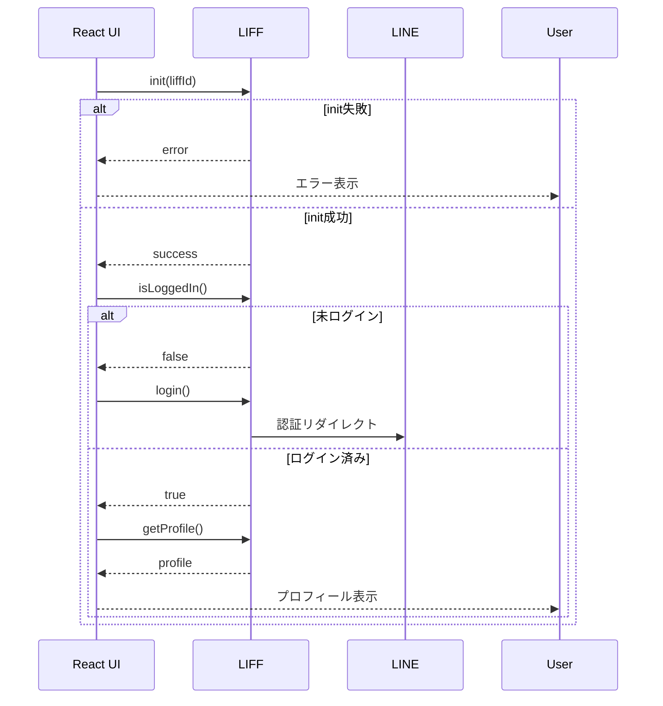

# 仕様書

現在のLINE MINI Appの機能はシンプルで、ログイン後にユーザーのプロフィール情報を表示するのみです。今後機能を拡張していく際の基盤として、現状の仕様を整理します。

## 機能一覧
1. **LIFF初期化**
   - `NEXT_PUBLIC_LIFF_ID` を使用して `liff.init()` を実行
   - 初期化失敗時はエラーメッセージを表示
2. **ログイン判定とログイン処理**
   - `liff.isLoggedIn()` でログイン状態を確認
   - 未ログインであれば `liff.login()` を実行しLINEの認証ページへ遷移
3. **プロフィール取得**
   - ログイン状態の場合 `liff.getProfile()` を実行
   - `displayName`, `userId`, `pictureUrl` を取得し画面に表示

## 画面遷移
現状ルートページ(`/`)のみ。今後は複数ページを追加予定です。

## シーケンス図（ログイン・プロフィール表示）

## データ保存場所
- 環境変数: `.env.local` に LIFF ID を保存
- ブラウザストレージ: LIFF SDK がアクセストークンを保持
- サーバー側保存: なし（今後必要に応じてバックエンドを追加予定）
