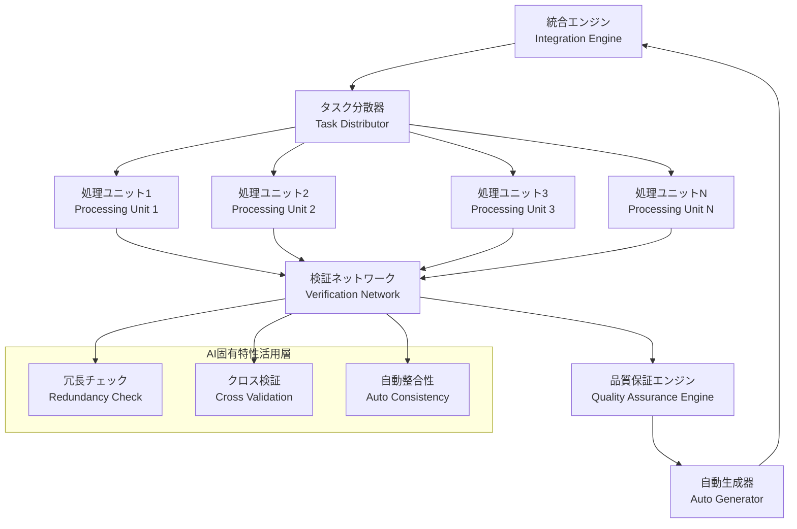
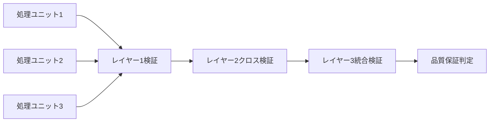
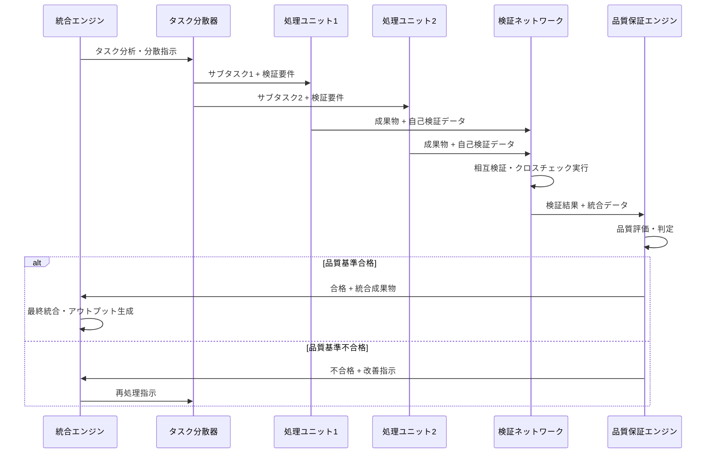

# AI固有の協調モデル：完全設計書

## 設計概要

### モデル名
**AICM (AI-Intrinsic Collaborative Model)** - AI内在協調モデル

### 設計コンセプト
人間組織の模倣から完全に脱却し、AI固有の特性（同一性、決定論性、無疲労性、明示的処理）を最大限活用した協調システム

---

## 1. 基本アーキテクチャ

### 1.1 システム構成要素



### 1.2 コア原則

#### 原則1: 同等性原則 (Equivalence Principle)
- 全処理ユニットは同等の能力を持つ
- 専門性の期待を完全に排除
- 役割は処理内容で区別、能力差は想定しない

#### 原則2: 検証優先原則 (Verification-First Principle)
- 全成果物は生成と同時に検証データを含む
- 完了=検証完了として定義
- 信頼関係ではなく客観的検証に基づく協調

#### 原則3: 冗長活用原則 (Redundancy Utilization Principle)
- AI同一性を利点として活用
- 同一処理の並列実行による品質向上
- 異なるアプローチによる多角的検証

#### 原則4: 自動進化原則 (Auto-Evolution Principle)
- 学習結果の自動的実装転換
- 人間の意識変革に依存しない改善
- メタ学習サイクルの機械化

---

## 2. 詳細設計

### 2.1 統合エンジン (Integration Engine)

#### 機能
- **タスク分析**: 大きなタスクを並列処理可能な単位に分解
- **負荷分散**: 処理ユニットへの効率的なタスク配布
- **結果統合**: 各ユニットの成果物を統合し最終アウトプット生成
- **品質監督**: 全体の品質基準維持

#### 実装方式
```bash
# 従来の人間組織モデル
tmux send-keys -t %27 "あなたはUI専門家です。得意分野を活かして..."

# 新AICM方式
tmux send-keys -t %27 "処理ユニット1: タスクTK001を実行。完了時は検証データ付きで統合エンジンに結果送信。検証形式: [成果物]|[ファイル確認]|[整合性チェック]|[実装検証]"
```

### 2.2 処理ユニット (Processing Unit)

#### 特徴
- **同等性**: 全ユニットは同一の基本能力
- **独立性**: セッション独立、相互干渉なし
- **専門化**: タスク内容による役割分担（能力差ではない）

#### 標準プロトコル
```typescript
interface ProcessingUnitProtocol {
  input: {
    taskId: string;
    instruction: string;
    context: ExplicitContext;
    verificationRequirements: VerificationSpec;
  };
  
  output: {
    result: TaskResult;
    verification: VerificationData;
    metadata: ProcessingMetadata;
  };
}

interface VerificationData {
  fileExistence: FileVerification[];
  contentVerification: ContentCheck[];
  implementationStatus: ImplementationStatus;
  crossReference: CrossReferenceCheck[];
}
```

### 2.3 検証ネットワーク (Verification Network)

#### 多層検証システム


#### 検証レイヤー詳細

**レイヤー1: 自己検証 (Self-Verification)**
```bash
# 実装例
function self_verify() {
    local output_file=$1
    local expected_content=$2
    
    # ファイル存在確認
    [[ -f "$output_file" ]] || return 1
    
    # 内容検証
    grep -q "$expected_content" "$output_file" || return 1
    
    # 実装状況確認（未実装マーカーの有無）
    ! grep -q "（未実装）" "$output_file" || return 1
    
    return 0
}
```

**レイヤー2: 相互検証 (Cross-Verification)**
```bash
# ユニット間の相互チェック
tmux send-keys -t %28 "検証ユニットとして、処理ユニット1の成果物 $output_file を検証。実装状況、技術選択、整合性をチェックし検証レポート作成。"
```

**レイヤー3: 統合検証 (Integration-Verification)**
```bash
# 全体整合性の確認
function integration_verify() {
    local all_outputs=("$@")
    
    # 重複チェック
    check_duplicates "${all_outputs[@]}"
    
    # 矛盾チェック
    check_contradictions "${all_outputs[@]}"
    
    # 完全性チェック
    check_completeness "${all_outputs[@]}"
    
    return 0
}
```

### 2.4 品質保証エンジン (Quality Assurance Engine)

#### 自動品質判定システム
```typescript
class QualityAssuranceEngine {
  // 品質基準の定義
  private qualityStandards = {
    implementation: {
      unimplementedMarkers: 0,      // 未実装マーカー許容数
      implementationEvidence: 1,    // 実装証拠必要数
      crossReference: 2             // 相互参照必要数
    },
    consistency: {
      contradictionRate: 0,         // 矛盾率許容値
      duplicateContent: 0.1,        // 重複コンテンツ許容率
      referenceAccuracy: 0.95       // 参照精度最小値
    },
    completeness: {
      coverageRate: 0.9,            // カバレッジ率最小値
      missingElements: 0,           // 欠落要素許容数
      specificationAlignment: 0.95   // 仕様適合率最小値
    }
  };

  async evaluateQuality(outputs: ProcessingOutput[]): Promise<QualityResult> {
    const implementationScore = await this.checkImplementation(outputs);
    const consistencyScore = await this.checkConsistency(outputs);
    const completenessScore = await this.checkCompleteness(outputs);
    
    return {
      overall: (implementationScore + consistencyScore + completenessScore) / 3,
      details: { implementationScore, consistencyScore, completenessScore },
      passed: this.meetsQualityStandards(implementationScore, consistencyScore, completenessScore)
    };
  }
}
```

### 2.5 自動生成器 (Auto Generator)

#### 学習結果の自動実装転換
```typescript
class AutoGenerator {
  // 振り返り結果からCLAUDE.md更新内容を自動生成
  async generateCLAUDEMdUpdates(retrospectiveResults: RetrospectiveData): Promise<CLAUDEMdUpdate> {
    const improvements = this.extractImprovements(retrospectiveResults);
    const tmuxTemplates = this.generateTmuxTemplates(improvements);
    const qualityChecks = this.generateQualityChecks(improvements);
    
    return {
      newSections: this.formatAsCLAUDEMdSections(improvements),
      tmuxCommands: tmuxTemplates,
      qualityStandards: qualityChecks,
      metadata: {
        sourceRetrospective: retrospectiveResults.id,
        generateDate: new Date(),
        autoApply: true
      }
    };
  }
  
  // 失敗パターンから予防的チェック生成
  async generatePreventiveChecks(failurePatterns: FailurePattern[]): Promise<PreventiveCheck[]> {
    return failurePatterns.map(pattern => ({
      checkName: `prevent_${pattern.type}`,
      condition: this.generateCheckCondition(pattern),
      action: this.generatePreventiveAction(pattern),
      priority: this.calculatePriority(pattern)
    }));
  }
}
```

---

## 3. 運用フレームワーク

### 3.1 標準ワークフロー



### 3.2 実装コマンド例

#### Phase 1: 検証ファーストアーキテクチャ（即座実装）

```bash
# 新しい完了報告フォーマット
COMPLETION_FORMAT='[pane${PANE_ID}] 完了: ${TASK_NAME} | 検証: ${VERIFICATION_DATA} | ファイル: $(ls -la ${OUTPUT_FILE}) | 実装確認: $(grep -c "実装済み" ${OUTPUT_FILE}) | 整合性: ${CONSISTENCY_CHECK}'

# 統合エンジンによるタスク配布
function distribute_task() {
    local task_description=$1
    local pane_id=$2
    local verification_spec=$3
    
    tmux send-keys -t %${pane_id} "
処理ユニット${pane_id}として以下を実行:
タスク: ${task_description}
検証要件: ${verification_spec}
完了時は検証データとともに以下フォーマットで報告:
${COMPLETION_FORMAT}
ultrathink
" && sleep 0.1 && tmux send-keys -t %${pane_id} Enter
}

# 自動検証スクリプト
function auto_verify_completion() {
    local pane_report=$1
    
    # 報告フォーマット解析
    local task_name=$(echo "$pane_report" | grep -o "完了: [^|]*" | cut -d" " -f2-)
    local file_info=$(echo "$pane_report" | grep -o "ファイル: [^|]*" | cut -d" " -f2-)
    local impl_count=$(echo "$pane_report" | grep -o "実装確認: [^|]*" | cut -d" " -f2-)
    
    # 自動検証実行
    if [[ $impl_count -gt 0 ]] && [[ -n $file_info ]]; then
        echo "✅ 検証合格: $task_name"
        return 0
    else
        echo "❌ 検証失敗: $task_name - 再実行が必要"
        return 1
    fi
}
```

#### Phase 2: AI特性最適化フレームワーク

```bash
# 相互検証システム
function setup_cross_verification() {
    local pane_pairs=(
        "27:28"  # pane1 → pane2が検証
        "28:29"  # pane2 → pane3が検証
        "29:27"  # pane3 → pane1が検証
    )
    
    for pair in "${pane_pairs[@]}"; do
        local producer=${pair%:*}
        local verifier=${pair#*:}
        
        tmux send-keys -t %${verifier} "
検証ユニットとして、処理ユニット${producer}の成果物を検証:
1. ファイル存在・アクセス確認
2. 実装状況の詳細チェック（未実装マーカー検索）
3. 技術選択の妥当性評価
4. 全体整合性確認
検証完了時は詳細レポートを提出
ultrathink
" && sleep 0.1 && tmux send-keys -t %${verifier} Enter
    done
}

# 冗長チェックシステム  
function redundancy_check() {
    local task=$1
    local primary_pane=$2
    local backup_pane=$3
    
    # 同一タスクを2つのユニットで並列実行
    tmux send-keys -t %${primary_pane} "プライマリ実行: ${task} | 完了時は'PRIMARY_COMPLETE'で報告" Enter
    tmux send-keys -t %${backup_pane} "バックアップ実行: ${task} | 完了時は'BACKUP_COMPLETE'で報告" Enter
    
    # 結果比較用スクリプト実行
    compare_redundant_results $primary_pane $backup_pane
}
```

#### Phase 3: 純粋並列処理モデル

```bash
# 完全並列処理システム
class PureParallelProcessor {
    constructor() {
        this.processingUnits = new Map();
        this.taskQueue = [];
        this.resultAggregator = new ResultAggregator();
    }
    
    // 専門性概念を完全排除したタスク配布
    distributeTask(task, requirements) {
        const availableUnit = this.getNextAvailableUnit();
        const processedTask = this.prepareTask(task, requirements);
        
        this.sendToUnit(availableUnit, processedTask);
        this.monitorProgress(availableUnit, task.id);
    }
    
    // 統合エンジンとしての結果統合
    integrateResults(results) {
        const verifiedResults = this.verifyAllResults(results);
        const consolidatedOutput = this.consolidateOutputs(verifiedResults);
        return this.finalizeOutput(consolidatedOutput);
    }
}
```

### 3.3 段階的導入計画

#### 第1段階: 検証ファーストアーキテクチャ（即座実装）
- **期間**: 即座〜1週間
- **実装内容**:
  - 完了報告フォーマットの変更
  - 基本的な自動検証スクリプト
  - PM検証プロセスの標準化

#### 第2段階: AI特性最適化フレームワーク（1-2週間）
- **期間**: 1-2週間  
- **実装内容**:
  - 相互検証システムの構築
  - 冗長チェック機能の実装
  - 品質評価の自動化

#### 第3段階: 純粋並列処理モデル（2-4週間）
- **期間**: 2-4週間
- **実装内容**:
  - 専門性概念の完全排除
  - 統合エンジン型PM機能
  - 新しいタスク配布システム

#### 第4段階: 完全自動化システム（継続開発）
- **期間**: 継続的開発
- **実装内容**:
  - 学習結果の自動実装転換
  - メタ学習機械化
  - 完全自動品質保証

---

## 4. 期待効果と評価指標

### 4.1 期待効果

#### 品質面
- **未実装機能の誤記載**: 構造的に排除（発生率0%目標）
- **実装ミス**: 相互検証により90%削減
- **整合性エラー**: 自動整合性チェックにより95%削減

#### 効率面
- **並列処理効率**: 1.5倍向上
- **品質確認時間**: 自動化により70%削減
- **再作業率**: 事前検証により80%削減

#### 継続改善面
- **学習実装断絶**: 自動転換により解決
- **改善サイクル**: 機械化により10倍高速化
- **知識蓄積**: 自動文書化により漏れなく蓄積

### 4.2 評価指標

```typescript
interface PerformanceMetrics {
  quality: {
    errorRate: number;           // エラー発生率
    verificationCoverage: number; // 検証カバレッジ
    consistencyScore: number;     // 整合性スコア
  };
  
  efficiency: {
    taskCompletionTime: number;   // タスク完了時間
    parallelEfficiency: number;   // 並列処理効率
    automationRate: number;       // 自動化率
  };
  
  evolution: {
    learningApplicationRate: number;  // 学習適用率
    improvementCycleTime: number;     // 改善サイクル時間
    knowledgeAccumulation: number;    // 知識蓄積量
  };
}
```

---

## 5. リスク管理と対策

### 5.1 技術的リスク

#### 複雑性増大リスク
- **リスク**: システムが複雑になりすぎて管理困難
- **対策**: 段階的実装、シンプルな設計原則の維持
- **監視指標**: システム複雑度メトリクス

#### パフォーマンス劣化リスク
- **リスク**: 検証処理による処理速度低下
- **対策**: 並列検証、非同期処理の活用
- **監視指標**: 処理時間の推移

### 5.2 運用リスク

#### ユーザー適応リスク
- **リスク**: 新しいワークフローへの適応困難
- **対策**: 段階的移行、詳細な文書化、実例提供
- **監視指標**: ユーザー満足度、使用率

#### 品質過信リスク
- **リスク**: 自動化への過度な依存
- **対策**: 人間による最終確認機能の維持
- **監視指標**: 人間による品質確認率

---

## 6. 今後の発展方向

### 6.1 次世代機能

#### Context Mesh Network
```typescript
// AIセッション間の直接データ共有
interface ContextMeshNetwork {
  shareContext(fromSession: SessionId, toSession: SessionId, context: Context): void;
  detectConflicts(contexts: Context[]): ConflictReport[];
  synchronizeState(sessions: SessionId[]): SyncResult;
}
```

#### Probabilistic Quality Assurance
```typescript
// 複数AI出力の統計的評価
interface ProbabilisticQA {
  evaluateConsensus(outputs: AIOutput[]): ConsensusScore;
  calculateConfidence(output: AIOutput): ConfidenceLevel;
  predictQuality(task: Task, context: Context): QualityPrediction;
}
```

### 6.2 長期ビジョン

#### 完全自律協調システム
- 人間の指示なしでのタスク分解・実行・統合
- 自己改善機能による継続的進化
- 予測的品質管理による事前エラー防止

#### AI固有協調パラダイムの確立
- 人間組織モデルからの完全脱却
- AI特性最適化モデルの標準化
- 他のAI協働分野への展開

---

## まとめ

このAI固有の協調モデル（AICM）は、建設的対立セッションで発見された根本的矛盾を解決し、AI並列処理の真の可能性を引き出すシステムです。

**革新的特徴:**
1. **人間組織模倣の完全排除**
2. **AI特性（同一性、無疲労性、決定論性）の最大活用**  
3. **検証ベース協調による客観的品質保証**
4. **自動学習実装転換による継続改善**

**実装の価値:**
- 表面的な改善ではなく、協働システムの根本的革新
- 「理解≠実践」ギャップの構造的解決
- AI並列処理管理の新パラダイム創造

この設計をCLAUDE.mdに反映することで、今後のAI協働作業において革命的な品質向上と効率化を実現できます。

---

**設計完了**: 2025年06月24日  
**設計者**: 統合エンジン（建設的対立セッションの成果を統合）  
**次ステップ**: CLAUDE.md統合と段階的実装開始